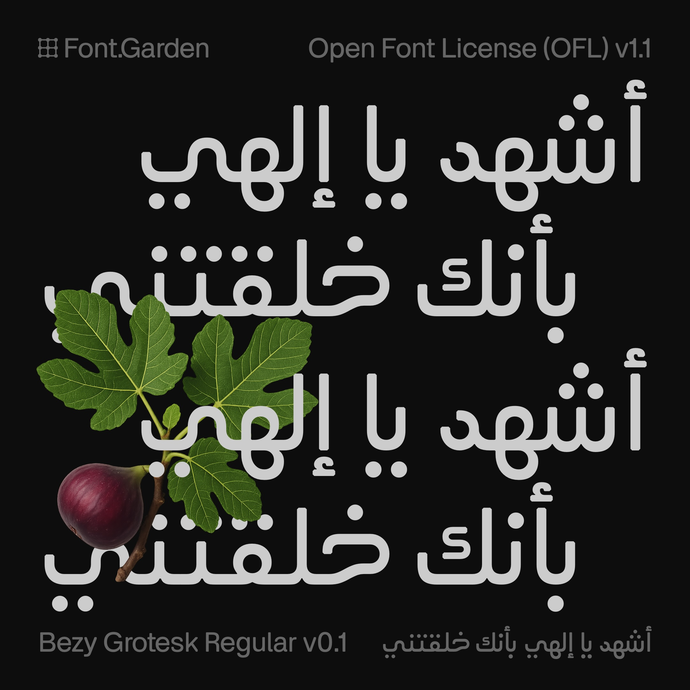
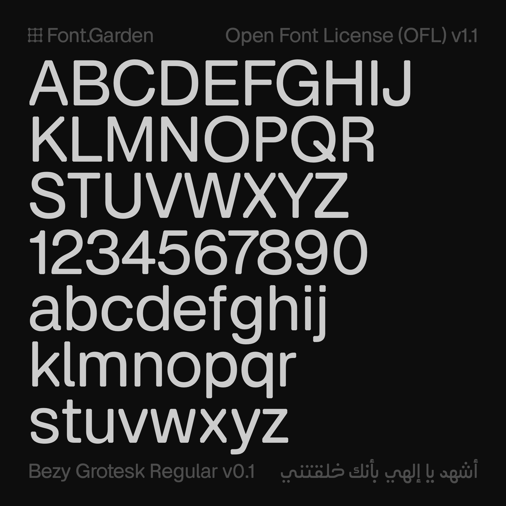

# Bezy Grotesk

A variable font family supporting the Latin and Arabic scripts. This is the default typeface used in the [Bezy](https://bezy.org) font editor project.

## License

This font is licensed under the SIL Open Font License (OFL), Version 1.1. This is a free and open source license that allows you to use, modify, and distribute the font for personal and commercial projects, as long as any forks and derivatives remain under the same license.
